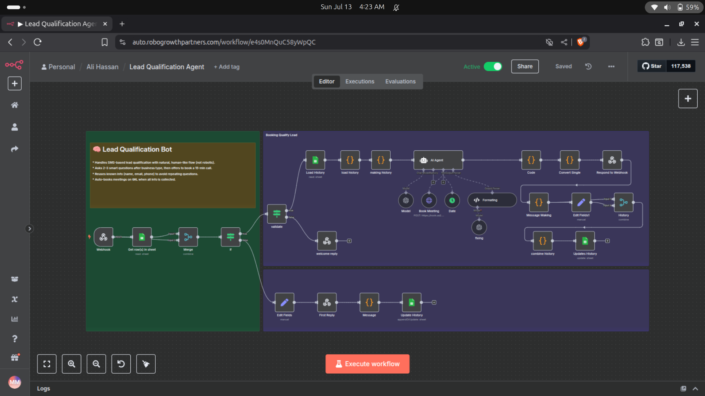

Here's a professional and clean **GitHub `README.md`** template for your **Lead Qualification Agent** project that books meetings via GoHighLevel (GHL) and includes a front end:

---

````markdown
# 🤖 Lead Qualification Agent



An AI-powered lead qualification and appointment booking agent built with a frontend interface. It guides leads through qualification steps using natural human-like conversation and books meetings directly on **GoHighLevel (GHL)**.

---

## 🚀 Features

- ✨ Natural LLM-based lead interaction
- 🎯 Qualification logic via FSM (Finite State Machine)
- 🧠 Memory-enabled conversation flow
- 📆 Meeting booking integration with GoHighLevel
- 🧩 Frontend for user interaction
- 📊 Lead intent tagging and dynamic flow adaptation

---

## 🖼️ Demo Screenshot

> Add your actual screenshot or screen recording (replace link)


---

## 🛠️ Tech Stack

| Layer       | Tech Used                      |
|-------------|--------------------------------|
| Frontend    | React / Next.js                |
| Backend     | FastAPI / Flask / Node.js      |
| AI Core     | OpenAI GPT-4 / LangChain       |
| Flow Engine | FSM with Intent Tagging        |
| Booking     | GoHighLevel API                |
| Hosting     | Vercel / Render / Railway      |

---

## ⚙️ Setup Instructions

### 1. Clone the repo

```bash
git clone https://github.com/alihassanml/Lead-Qualification-Agent.git
cd Lead-Qualification-Agent
````

### 2. Set up environment variables

Create a `.env` file:

```env
OPENAI_API_KEY=your_openai_key
GHL_API_KEY=your_ghl_key
GHL_LOCATION_ID=your_location_id
```

### 3. Install dependencies

For backend:

```bash
cd backend
pip install -r requirements.txt
```

For frontend:

```bash
cd frontend
npm install
```

### 4. Run the app

```bash
# Run backend
cd backend
uvicorn main:app --reload

# Run frontend
cd frontend
npm run dev
```

---

## 📅 Booking Integration (GHL)

Meeting booking is handled by sending lead data to GoHighLevel using the GHL API. Make sure you have:

* Created a calendar inside GHL
* Set the correct `GHL_LOCATION_ID` and `GHL_API_KEY`
* Confirmed availability is configured correctly

---

## 📁 Folder Structure

```
Lead-Qualification-Agent/
│
├── backend/              # API + AI logic
│   └── main.py
├── frontend/             # React UI
│   └── components/
│
├── utils/                # FSM, memory, flow logic
├── .env.example
└── README.md
```

---

## 📬 Contact

Built with 💻 by [Ali Hassan](https://github.com/alihassanml)
For issues or enhancements, please open a pull request or issue.

---

## 📜 License

MIT License
